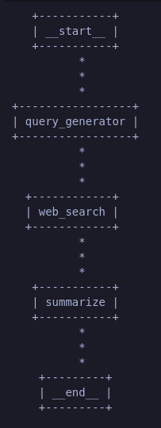
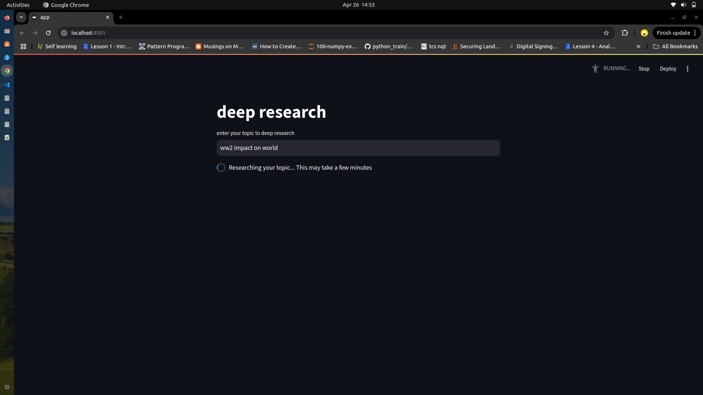
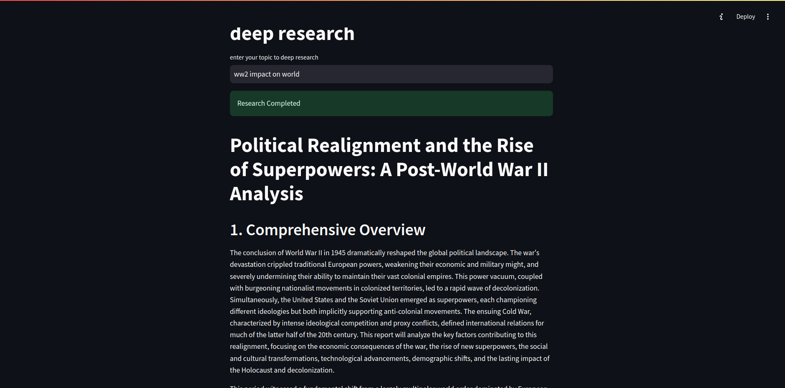
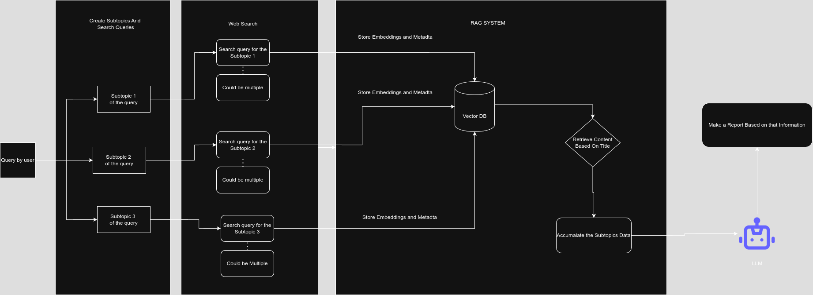

# Deep Research Assistant

An Deep research tool that breaks down broad topics into subtopics, performs web searches, and generates comprehensive research reports using LangChain, LangGraph, and Google's Gemini AI.

## Overview

This application allows users to input any research topic and automatically:

1. Breaks the topic into detailed subtopics
2. Generates relevant search queries for each subtopic
3. Retrieves high-quality content from the web
4. Organizes the information in a vector database
5. Synthesizes a comprehensive, structured research report



## Features

- **Intelligent Topic Decomposition**: Uses Gemini AI to break down broad topics into focused subtopics
- **Automated Web Research**: Performs targeted web searches via Tavily API
- **Vector Database Storage**: Stores and organizes research content using ChromaDB
- **Advanced Report Generation**: Creates detailed, well-structured research reports
- **Simple Web Interface**: Easy-to-use Streamlit interface

## Requirements

- Python 3.8+
- Google Gemini API key
- Tavily API key

## Installation

1. Clone this repository:
```bash
git clone https://github.com/yourusername/deep-research.git
cd deep-research
```

2. Install dependencies:
```bash
pip install -r requirements.txt
```

3. Create a `.env` file in the root directory and add your API keys:
```bash
# Create .env file
touch .env

# Add the following lines to the .env file
GOOGLE_API_KEY="your_gemini_api_key"
TAVILY_API_KEY="your_tavily_api_key"
```

## Usage

1. Start the Streamlit app:
```bash
streamlit run app.py
```

2. Open your browser and navigate to the displayed URL (typically http://localhost:8501)

3. Enter a topic in the input field and click Enter

   

4. Wait for the research process to complete (this may take a few minutes)

5. View the comprehensive research report

   

## How It Works

The application follows a structured workflow:

1. **Query Generation**: The input topic is processed by a Gemini-powered agent that breaks it down into subtopics and generates search queries.

2. **Web Search**: The Tavily search API retrieves relevant content for each search query.

3. **Content Processing**: Retrieved content is split into chunks and stored in a ChromaDB vector database with embeddings.

4. **Report Generation**: The system retrieves relevant content from the vector database and uses Gemini to synthesize a comprehensive research report following academic standards.





## Project Structure

- `app.py`: Main application file containing the Streamlit interface and workflow
- `requirements.txt`: List of Python dependencies
- `.env`: Configuration file for API keys
- `running_logs.log`: Log file for debugging and monitoring


## Future Enhancements

- A React based Agent Implementation (Currently its a Flow based Implementation)
- Memory Support
- Chat History Implementation


